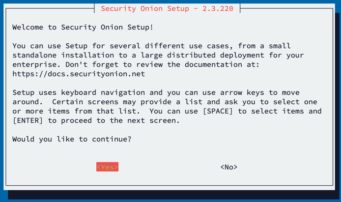

*** Security Onion 2 Install Instructions ***

Create the infrastructure using Terraform.

Connect to Onion server and follow the [Installation Instructions](https://docs.securityonion.net/en/2.3/installation.html). Recommendations are as follows:

[Config_security_onion.mov](..%2F..%2F..%2F..%2FDownloads%2FConfig_security_onion.mov)
